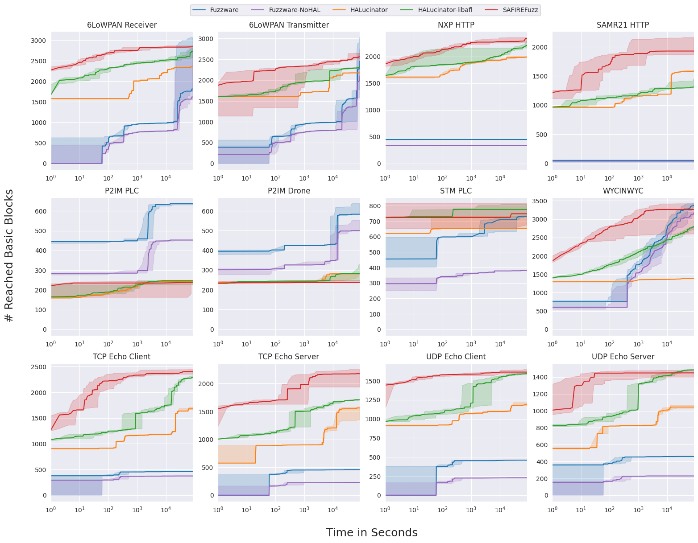

# Data
This directory contains the raw data collected during evaluation for the paper.  

We attach the jupyter notebooks we used for conducting the Mann-Whitney U tests
for statistical significance.

## Coverage
The four sub-directories, one per evaluated fuzzing framework, contain files
tracking the amount of reached basic blocks over time.  
For every target there are five files, one per 24-hour fuzzing campaign.

To generate figure 3, please use the according jupyter notebook.
If you want to generate the figure using your own coverage data, you will need to replace the data files with the results of your own fuzzing runs & coverage collection replays.

The `bb_mann_whitney.ipynb` in the coverage directory additionally prints the median value across the five experiment runs.

## Executions
The directory contains datasheets with information collected during our experiments.  
The number of executions were read out from the AFL/AFL++ CLI once
a campaign had finished (after 24 hours exactly).
The `exec/s` metric reported in the paper was consequently obtained by simply dividing this number by 24 hours.

 
 

